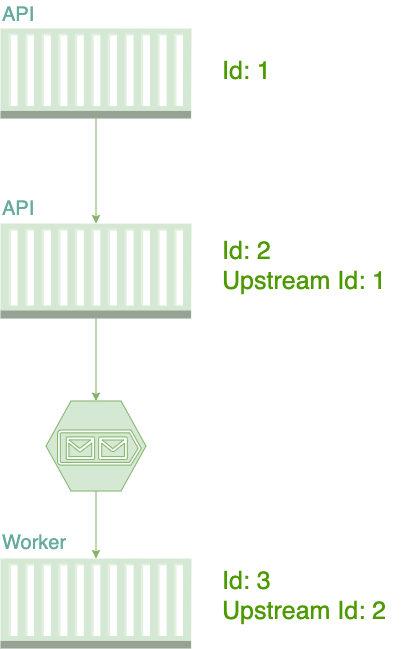
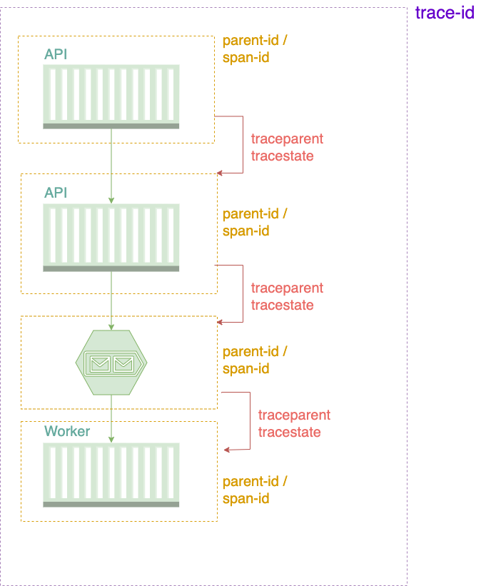

# W3C's Trace Context standard and how to enrich message tracing with APM tools

In the software development process, when a system experiences a failure in runtime, it's natural for a developer to try to link that failure with who called that method and also which was the original request. This is where [stack trace](https://en.wikipedia.org/wiki/Stack_trace) comes in, look at an example below:

``` bash
Unhandled exception. System.InvalidOperationException: Stack trace example
   at Program.CallChildActivity() in /Users/luizhlelis/Documents/projects/personal/trace-context-w3c/src/system-diagnostics-activity/Program.cs:line 22
   at Program.Main() in /Users/luizhlelis/Documents/projects/personal/trace-context-w3c/src/system-diagnostics-activity/Program.cs:line 11
```

with the information above we're able to know that a failure happened at `CallChildActivity()` method (line 22) which was called by the `Main()` method (line 11) both inside the `Program.cs` class. That's the reason why the runtime message tracking is essential for a software health and reliability, a rich information like that greatly increases the troubleshoot productivity. So the `stack trace` serves very well in terms of message trace when the subject is a single process application, like monolithic systems. On the other hand, when dealing with distributed systems like in a microservice architecture, the stack trace is not enough to expose the entire message tracking, that's the reason why distributed tracing tools and standards became necessary. The W3C defines a standard for this type of tracking, which is called `Trace Context`.

## W3C Trace Context purpose

Imagine a system designed as a microservice architecture where two APIs communicate in a synchronous way (http calls) and the second API communicates with a worker by a message broker:

### <a name="firstfigure"></a>Figure 1 - Distributed trace



just like the `stack trace`, every `Activity` needs an Id to be identifiable and also needs to know the `Activity` Id of who called it. With the purpose of solve this kind of problem, some vendors came up delivering not only the distributed trace message information but also the application performance, the load time, the application's response time, and other stuff. That kind of vendor are called Application Performance Management tools (APM tools) or also trace systems, below are some examples:

- Dynatrace
- New Relic
- Application Insights
- Elastic APM
- Zipkin

> **_NOTE:_**  I chose to use the term `vendor` to describe all the trace systems because that's the way as the standard refers to them. But it seems that [it'll be changed soon](https://github.com/w3c/trace-context/issues/387).

now imagine a scenery where there are many vendors and also many languages with different diagnostics libraries, some of them identify a trace with an `operation-id`, other calls it as `request-id` and also there is another one which reconize it as a `trace-id`, besides that, the id's format changes depending on vendor or diagnostic library: one is in the `hierarchical` format, another one is an `UUID` and there is also a 24 character `string` identifier. That scenery would result in: systems with different tracing vendors will not be able to correlate the traces and also will not be able to propagate traces as there is no unique identification that is forwarded. This is where trace context standard comes in.

## The trace context standard

The [W3C Trace Context](https://www.w3.org/TR/trace-context/) specification defines a standard to HTTP headers and formats to propagate the distributed tracing context information. It defines two fields that should be propagated in the http request's header throughout the trace flow. Take a look below at the standard definition of each field:

- `traceparent`: identifier responsible to describe the incoming request position in its trace graph. It represents a common format of the incoming request in a tracing system, understood by all vendors.

- `tracestate`: extends traceparent with vendor-specific data represented by a set of name/value pairs. Storing information in tracestate is optional.

## The `traceparent` field

The `traceparent` field uses the Augmented Backus-Naur Form (ABNF) notation of [RFC5234](https://www.w3.org/TR/trace-context/#bib-rfc5234) and is composed by 4 sub-fields:

`version` - `traceid` - `parentid/spanid` - `traceflags`

> **_NOTE:_**  `sub-field` term is unofficial, I chose this term for didactic purposes only

for example:

``` bash
00-480e22a2781fe54d992d878662248d94-b4b37b64bb3f6141-00
```

- `version` (8-bit): trace context version that the system has adopted. The current is `00`.

- `trace-id` (16-byte array): the ID of the whole trace and is used to identify a distributed trace globally through a system.

- `parent-id` / `span-id` (8-byte array): used to identify the parent of the current span on incoming requests or the current span on an outgoing request.

- `trace-flags` (8-bit): flags that represent recommendations of the caller. Can be also thought as the caller recommendations and are strict to three reasons: trust and abuse, bug in the caller or different load between caller and callee service.

> **_NOTE:_** all the fields are encoded as `hexadecimal`

Therefore, applying the trace context concept in an application like the [Figure 1](#firstfigure) will result in the diagram below:

### <a name="firstfigure"></a>Figure 2 - Propagation fields


note that the `trace-id` is an identifier of all the trace, the `parent-id` identifies a delimited scope of the whole trace. Moreover, the `traceparent` along with the `tracestate` are been propagated throughout the trace flow.

`parent-id` could cause confusion due to its name

[Trace Context Level 2](https://w3c.github.io/trace-context/) that has an response standard where the `parent-id` call `child-id`
## The `tracestate` field

The standard uses a fictitious example to describe what is `tracestate` for and I will reproduce it in this article: imagine a client and server system that use different trace vendors, the first is called Congo and the second is called Rojo. A client traced in the Congo system adds in `tracestate` the vendor-specific id (with its specific format): `tracestate: congo=t61rcWkgMzE`. So the outbound HTTP request will be

any other user-supplied or application information shoud be added in the [baggage](https://w3c.github.io/baggage/) field, that is in the Working Draft (WD) step of the [w3c process](https://www.w3.org/2017/Process-20170301/#working-draft) (is not a w3c recomendation yet).

## Trace Context: AMQP protocol

Another example of document in Working Draft (WD) step of the [w3c process](https://www.w3.org/2017/Process-20170301/#working-draft) is the
[Trace Context: AMQP protocol](https://w3c.github.io/trace-context-amqp/).

take a look at [sample code](src/).
